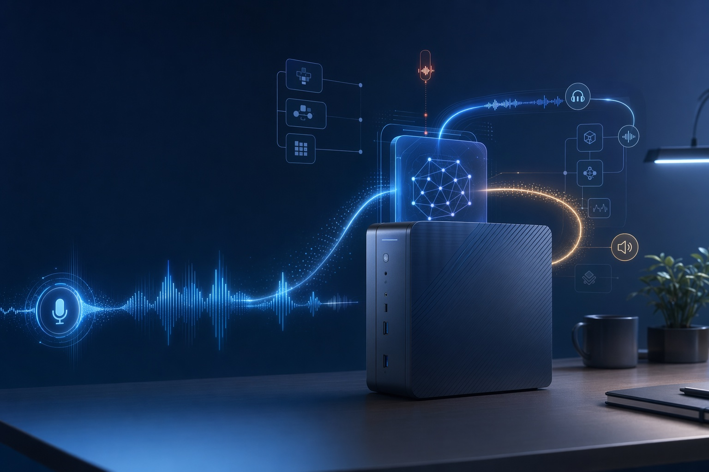

# Pharos Voice Action Gateway



Pharos Voice Action Gateway 是一个可复用的 Skill-to-Agent 模块：它先用本地全双工语音网关判断用户是否真正说完，再把完整语音意图转换成 Pharos 链上动作预览、确认门、交易模拟和会话证明。

它保留 Local Duplex Voice Gateway 的核心能力：判断用户是否说完、是否短暂停顿、是否插话打断、是否应该提交给 Agent 大脑；同时新增面向 Pharos AI Agent 经济的 on-chain action layer。

## 为什么做这个

语音 Agent 真正难用的地方，往往不是“识别一句话”，而是这些细节：

- 用户停顿 300ms，是想继续说，还是已经说完？
- TTS 还在播放时用户插话，要不要立刻停？
- 用户说“嗯，等一下，我想改一下”，这是不是新的意图？
- Agent 什么时候该调用工具，什么时候该继续听？

Pharos Voice Action Gateway 把这些问题变成可复用的 Skill，并加入链上动作安全层：

- `Voice intent commit`：只有完整语音轮次才会转成结构化 intent。
- `Explicit confirmation gate`：付款、合约调用、会话证明等高风险动作必须二次确认。
- `Pharos transaction adapter`：默认 mock-first，输出 Pharos/EVM 交易预览和 deterministic tx hash。
- `On-chain voice session proof`：生成 voice hash、intent hash 和 proof payload，后续可写入合约。
- `AgentSkill/MCP tools`：提供 5 个工具 schema，方便 Agent 编排调用。

## 快速开始

```bash
python scripts/duplex_voice_gateway.py demo/duplex_conversation.jsonl
python scripts/duplex_voice_gateway.py demo/duplex_conversation.jsonl --format json
python scripts/run_demo_tests.py

python scripts/pharos_voice_action_gateway.py demo/pharos_payment_confirmed.jsonl
python scripts/pharos_voice_action_gateway.py demo/pharos_payment_pending.jsonl
python scripts/run_pharos_demo_tests.py
```

基础 demo 只需要 Python 3.8+ 标准库。

## 输入格式

demo 使用 JSONL 模拟流式 ASR/VAD/TTS 事件：

```json
{"t": 0.00, "type": "asr_partial", "text": "帮我", "speech": true}
{"t": 0.42, "type": "asr_partial", "text": "帮我总结这份合同", "speech": true}
{"t": 1.35, "type": "silence", "speech": false}
{"t": 1.90, "type": "silence", "speech": false}
{"t": 2.05, "type": "tts_start", "text": "我先帮你看一下"}
{"t": 2.30, "type": "asr_partial", "text": "等一下", "speech": true}
```

## 输出事件

| 事件 | 含义 |
|---|---|
| `listen` | 继续收音 |
| `hold` | 用户短暂停顿，暂不提交 |
| `commit_turn` | 用户一句话结束，可以交给 Agent |
| `interrupt_tts` | 用户插话，应停止 TTS |
| `tts_started` | TTS 开始播放 |
| `tts_finished` | TTS 播放结束 |

## Pharos 输出

`scripts/pharos_voice_action_gateway.py` 会生成 JSON 报告，包含：

| 字段 | 含义 |
|---|---|
| `voice.committed_turns` | 被确认完整的用户语音轮次 |
| `intent` | `send_payment`、`check_balance`、`write_session_proof` 等结构化意图 |
| `confirmation` | `confirmed`、`pending_confirmation`、`cancelled` 或 `not_required` |
| `prepared_action.transaction_preview` | Pharos/EVM 交易预览或只读动作 |
| `prepared_action.proof_payload` | 可上链的 voice hash、intent hash、action id |
| `submission` | mock 模式下的 deterministic tx/proof hash，或 wallet 模式下的待签名状态 |
| `mcp_tools` | Agent 可调用的 MCP/AgentSkill 工具 schema |

## Demo 场景

- `demo/pharos_payment_confirmed.jsonl`：用户语音发起 0.02 PHRS 付款，并明确确认执行，最终生成 mock tx hash。
- `demo/pharos_payment_pending.jsonl`：用户语音发起 0.05 PHRS 付款，但没有确认，系统阻断交易提交。
- `demo/pharos_session_proof_confirmed.jsonl`：用户要求把语音会话证明上链，确认后生成 proof payload。

## AI PC / OpenVINO 规划

当前仓库先提供可复现的语音网关控制层。实际产品接入时：

- ModelScope VAD/ASR/TTS 模型作为本地语音工具来源，详见 `references/modelscope-voice-stack.md`。
- OpenVINO 加速 ASR / VAD / EOU / TTS 模型，降低端侧延迟。
- 35B 以下本地模型作为 Agent 大脑，负责理解用户意图和调用工具。
- 本地 TTS 负责语音回复。
- Gateway 管理打断、端点判断和会话状态。
- Pharos/EVM 钱包适配器负责真实签名和广播。默认 demo 不保存私钥、不发真实交易。

## License

Apache-2.0
