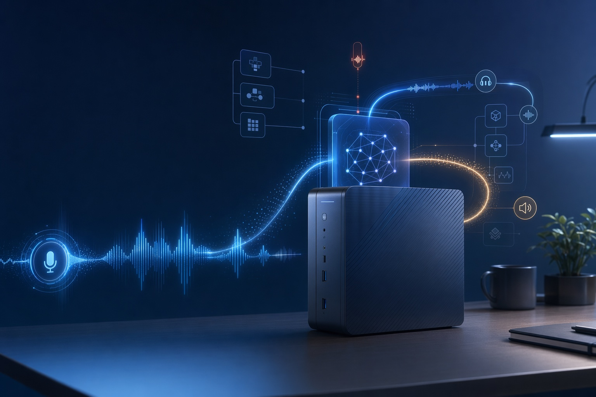
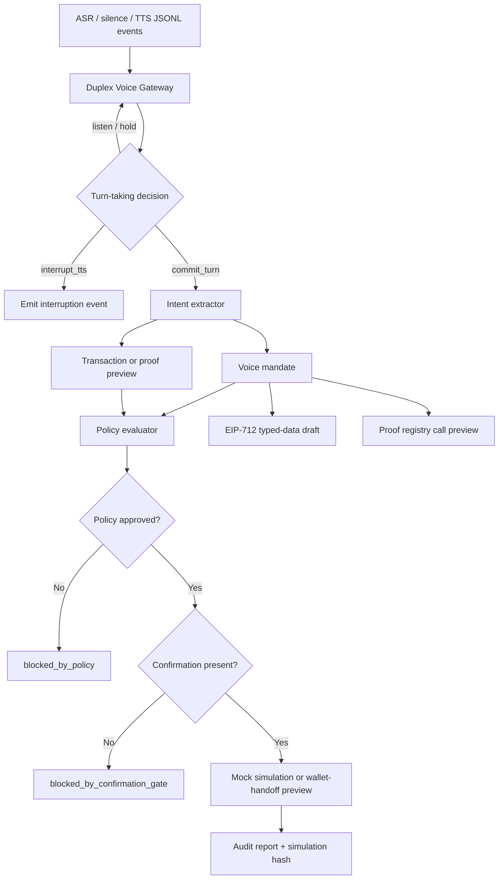

# Pharos Voice Action Gateway

> A confirmation-gated voice-to-onchain safety layer for Pharos agents.

[](https://www.python.org/)
[](LICENSE)
[](#current-boundaries)
[](https://dorahacks.io/build/44805)



Pharos Voice Action Gateway is a dependency-free reference implementation for
safer voice-driven blockchain agents. It solves two problems that are easy to
underestimate:

1. **When is a spoken instruction complete?**
2. **When is an agent actually allowed to prepare or execute an onchain
   action?**

The gateway reads timestamped speech-event fixtures, decides when an utterance
appears complete, and turns committed text into a structured Pharos action
preview. Before an action can proceed to simulation, it must pass both a
policy check and, where required, a confirmation check.

Instead of broadcasting transactions, the default demo produces inspectable
artifacts: a transaction preview, voice and intent hashes, a voice mandate,
policy results, an EIP-712-shaped typed-data payload, a proof-registry call
preview, an audit timeline, and a deterministic simulation hash.

**Try it without moving funds.** The Python demos run entirely offline with
the standard library. They do not capture audio, call an RPC, connect a wallet,
or submit a transaction, in either execution mode.

[Quick start](#quick-start) |
[Watch the narrated demo](assets/demo/pharos-voice-action-gateway-demo-mimo-voiced.mp4) |
[DoraHacks submission](https://dorahacks.io/build/44805)

## Contents

- [Why this project exists](#why-this-project-exists)
- [What is implemented](#what-is-implemented)
- [Architecture](#architecture)
- [Quick start](#quick-start)
- [Demo scenarios](#demo-scenarios)
- [Input event format](#input-event-format)
- [Output contract](#output-contract)
- [Safety model](#safety-model)
- [Agent and MCP integration](#agent-and-mcp-integration)
- [Proof registry](#proof-registry)
- [Project structure](#project-structure)
- [Current boundaries](#current-boundaries)
- [Production roadmap](#production-roadmap)
- [Hackathon background](#hackathon-background)
- [Further reading](#further-reading)
- [Contributing](#contributing)
- [License](#license)

## Why this project exists

Voice agents introduce failure modes that text interfaces do not:

- a short pause may be mistaken for the end of an instruction;
- partial ASR text may be submitted before the user finishes speaking;
- a user may interrupt TTS to correct the agent;
- a casual "yes" may be interpreted as transaction approval;
- confirmation may be treated as permission to bypass policy;
- raw audio may be retained even when only a proof is required.

Those failures become costly when an agent controls a wallet. A reliable
voice-to-onchain system therefore needs more than speech recognition. It needs
an execution boundary.

Pharos Voice Action Gateway introduces that boundary:

```text
voice events
  -> turn-taking decisions
  -> committed utterance
  -> structured intent
  -> action preview + mandate
  -> policy and confirmation checks
  -> blocked result or offline simulation / wallet-handoff preview
```

The central rule is simple:

> Human confirmation is necessary for a risky action, but confirmation alone
> is never sufficient to override safety policy.

## What is implemented

| Capability | Current implementation |
|---|---|
| Turn detection | Heuristic processing of timestamped ASR, silence, and TTS events |
| Short-pause handling | Emits `hold` while an utterance appears incomplete |
| End-of-utterance commit | Emits `commit_turn` only after completion criteria are met |
| Barge-in handling | Emits `interrupt_tts` when the user interrupts active TTS |
| Intent extraction | Deterministic parsing for payment, balance, proof, and generic intents |
| Confirmation gate | Blocks medium- and high-risk actions without explicit confirmation |
| Cancellation handling | Detects English and Chinese cancellation phrases |
| Policy checks | Payment amount, token allowlist, trusted recipient, mandate-hash presence, and a no-audio-storage flag |
| Voice mandate | Collects event-evidence hashes, intent, action scope, and declared expiry duration |
| Readback challenge | Generates an action-specific phrase for a future strict confirmation adapter |
| EIP-712 draft | Exports a `VoiceMandate` typed-data structure for wallet integration |
| Proof artifacts | Produces voice, intent, mandate, policy, and typed-data hashes |
| Transaction adapter | Generates read-only, payment, or proof transaction previews |
| Simulation | Produces deterministic evidence without broadcasting a transaction |
| Solidity registry | Includes a minimal `VoiceSessionProofRegistry` draft for hashes and metadata |
| Agent tool contract | Exports seven tool schemas intended for an MCP/AgentSkill integration |

## Architecture


```mermaid
flowchart TD
    A["ASR / silence / TTS JSONL events"] --> B["Duplex Voice Gateway"]
    B --> C{"Turn-taking decision"}
    C -->|"listen / hold"| B
    C -->|"interrupt_tts"| D["Emit interruption event"]
    C -->|"commit_turn"| E["Intent extractor"]

    E --> F["Voice mandate"]
    E --> G["Transaction or proof preview"]
    F --> H["Policy evaluator"]
    G --> H

    H --> I{"Policy approved?"}
    I -->|"No"| J["blocked_by_policy"]
    I -->|"Yes"| K{"Confirmation present?"}
    K -->|"No"| L["blocked_by_confirmation_gate"]
    K -->|"Yes"| M["Mock simulation or wallet-handoff preview"]

    F --> N["EIP-712 typed-data draft"]
    F --> O["Proof registry call preview"]
    M --> P["Audit report + simulation hash"]
```

The diagram shows the logical decision path. In the current batch runner,
confirmation is detected from committed text before action preparation; the
submission stage then enforces the policy block before the confirmation block.
An interruption is an output event, not an actual audio-playback operation.

## Quick start

### Requirements

- Python **3.9 or newer**; the documented commands were verified on Python 3.9.6
- No third-party Python packages
- No wallet, RPC endpoint, API key, or speech model required for the demos

Clone and enter the repository:

```bash
git clone https://github.com/Chengyuann/pharos-voice-action-gateway.git
cd pharos-voice-action-gateway
```

Run the complete smoke-test suite:

```bash
python3 scripts/run_demo_tests.py
python3 scripts/run_pharos_demo_tests.py
```

Expected result:

```text
PASS duplex_conversation: commit_turn + interrupt_tts
PASS short_pause_continuation: hold before commit
PASS pharos_payment_confirmed: EIP-712 mandate + policy + simulated tx
PASS pharos_payment_pending: high-risk action blocked without confirmation
PASS pharos_payment_policy_blocked: confirmation cannot bypass policy
PASS pharos_session_proof_confirmed: proof payload + MCP tool schema
PASS VoiceSessionProofRegistry.sol: registry draft present
```

Run the turn-taking gateway:

```bash
python3 scripts/duplex_voice_gateway.py demo/duplex_conversation.jsonl
python3 scripts/duplex_voice_gateway.py \
  demo/duplex_conversation.jsonl \
  --format json \
  --output duplex_report.json
```

Run a Pharos action scenario:

```bash
python3 scripts/pharos_voice_action_gateway.py \
  demo/pharos_payment_confirmed.jsonl \
  --output pharos_report.json
```

The CLI prints a short summary and writes the full report to the selected
output path. Without `--output`, it creates a timestamped report in the current
directory. Use a new filename to preserve an existing report.

The action CLI defaults to `--mode mock`. To inspect the future wallet handoff:

```bash
python3 scripts/pharos_voice_action_gateway.py \
  demo/pharos_payment_confirmed.jsonl \
  --mode wallet \
  --output wallet_report.json
```

For this approved fixture, the status becomes `ready_for_wallet_signature`.
**This is a preparation status, not a wallet connection or a signed transaction.**

## Demo scenarios

### 1. Confirmed payment

```text
User: send 0.02 PHRS to 0x1111111111111111111111111111111111111111
Agent: I prepared a Pharos payment preview. Please confirm before I submit anything.
User: wait
User: confirm execute
```

Result:

- barge-in is detected and an `interrupt_tts` event is emitted;
- the payment is within the demo limit;
- the recipient is trusted;
- explicit confirmation is detected; and
- a deterministic simulation hash is returned.

```bash
python3 scripts/pharos_voice_action_gateway.py \
  demo/pharos_payment_confirmed.jsonl
```

### 2. Missing confirmation

The user requests a `0.05 PHRS` transfer to a trusted recipient but never
confirms it.

Result: `blocked_by_confirmation_gate`.

```bash
python3 scripts/pharos_voice_action_gateway.py \
  demo/pharos_payment_pending.jsonl
```

### 3. Confirmation cannot bypass policy

The user requests a `0.50 PHRS` transfer to an untrusted recipient and then
says `confirm execute`.

Result: `blocked_by_policy`, with `amount_limit` and `recipient_trust` listed as
blocking reasons.

```bash
python3 scripts/pharos_voice_action_gateway.py \
  demo/pharos_payment_policy_blocked.jsonl
```

### 4. Voice-session proof

The user requests a proof of the voice session and confirms it.

Result:

- a proof payload is generated;
- no audio is captured or stored by the demo;
- an EIP-712-shaped mandate is exported; and
- `VoiceSessionProofRegistry.recordVoiceMandate` arguments are prepared,
  without sending a contract call.

```bash
python3 scripts/pharos_voice_action_gateway.py \
  demo/pharos_session_proof_confirmed.jsonl
```

## Input event format

The demos use JSON Lines to represent a stream from future local speech
adapters. ASR means automatic speech recognition, VAD means voice activity
detection, and TTS means text-to-speech.

Each line is a separate JSON object. `t` is a timestamp in seconds, `type`
selects the event, and `text` carries the transcript or playback text. The
loader sorts events by timestamp. ASR updates should contain the full current
hypothesis, not just the next word: each update replaces the buffered text.

```json
{"t": 0.00, "type": "asr_partial", "text": "send", "speech": true}
{"t": 0.82, "type": "asr_final", "text": "send 0.02 PHRS to 0x1111111111111111111111111111111111111111", "speech": true}
{"t": 1.62, "type": "silence", "speech": false}
{"t": 1.85, "type": "tts_start", "text": "Please confirm before I submit anything."}
{"t": 2.20, "type": "asr_partial", "text": "wait", "speech": true}
{"t": 2.50, "type": "asr_final", "text": "confirm execute", "speech": true}
{"t": 3.30, "type": "silence", "speech": false}
```

Supported event types:

| Event | Purpose |
|---|---|
| `asr_partial` | Update the current in-progress transcript |
| `asr_final` | Provide a final ASR hypothesis |
| `silence` | Measure pause duration and evaluate end-of-utterance |
| `tts_start` | Mark agent speech as active |
| `tts_end` | Mark agent speech as complete |

The `speech` flag is accepted as metadata; event dispatch and timing drive the
current heuristics. There is no separate `vad` event type. Unknown types emit
an `ignore` event. A final partial utterance needs an explicit silence event
to trigger pause-based evaluation; end-of-file does not force a commit.

Turn-taking output:

| Action | Meaning |
|---|---|
| `listen` | Continue collecting speech |
| `hold` | Preserve the partial utterance through a short or incomplete pause |
| `commit_turn` | Mark an utterance as complete according to the heuristic |
| `interrupt_tts` | Signal a playback adapter to stop TTS after a detected interruption |
| `tts_started` | Record that agent speech began |
| `tts_finished` | Record that agent speech ended |

The default end-of-utterance silence threshold is `700 ms`, with a short-pause
threshold of `280 ms`. These are heuristic inputs, not a measured latency
guarantee: text-completion and continuation cues can commit earlier or keep
waiting longer. The voice-only CLI exposes the silence threshold:

```bash
python3 scripts/duplex_voice_gateway.py \
  demo/duplex_conversation.jsonl \
  --eou-silence-ms 900
```

## Output contract

`scripts/pharos_voice_action_gateway.py` writes a JSON report with these
top-level objects:

| Field | Description |
|---|---|
| `voice` | Committed turns, interruptions, and turn-taking events |
| `intent` | Parsed action, heuristic confidence, summary, parameters, risk, and intent hash |
| `confirmation` | `confirmed`, `pending_confirmation`, `cancelled`, or `not_required` |
| `prepared_action` | All artifacts prepared before submission |
| `submission` | Policy or confirmation block, simulation result, or wallet-ready status |
| `mcp_tools` | Tool schema catalog for agent orchestration |

Important `prepared_action` fields:

| Field | Description |
|---|---|
| `transaction_preview` | Read-only query, payment transfer, proof write, or generic summary preview |
| `proof_payload` | Voice hash, intent hash, mandate hash, action ID, and timestamps |
| `mandate` | Scoped evidence with a declared five-minute expiry duration, not an enforced deadline |
| `policy_decision` | Individual checks, blocking reasons, and policy hash |
| `challenge` | Generated readback phrase tied to the action and mandate |
| `audit_timeline` | Ordered record from voice events through policy and confirmation |
| `eip712` | EIP-712-shaped `VoiceMandate` payload and deterministic demo hash |
| `registry_call` | `recordVoiceMandate` arguments and calldata signature preview |

For the confirmed-payment fixture, the key decisions are:

| Report path | Value |
|---|---|
| `intent.action` | `send_payment` |
| `intent.params.amount` | `"0.02"` |
| `voice.interrupts` | `1` |
| `confirmation.status` | `confirmed` |
| `prepared_action.policy_decision.decision` | `approved_for_confirmation` |
| `prepared_action.eip712.signature_status` | `unsigned_demo_payload` |
| `submission.status` | `simulated` |

The generated `tx_hash` is a **simulation identifier** in both modes, not a
network transaction hash. The `pharos://tx/` value is a demo URI, not a public
explorer link. Stable decision artifacts and simulation hashes are repeatable
for the same input and configuration; report timestamps change between runs.

## Safety model

### Default demo policy

```text
Maximum single payment: 0.05 token units (PHRS in the payment fixtures)
Allowed tokens: PHRS, PROS, USDC, USDT
Trusted recipients:
  0x1111111111111111111111111111111111111111
  0x2222222222222222222222222222222222222222
Raw audio stored: no
Private keys stored: no
Transaction broadcast: no
```

These defaults live in `DEFAULT_POLICY` in
[`scripts/pharos_voice_action_gateway.py`](scripts/pharos_voice_action_gateway.py).
The limit is the same raw amount for every allowed token; it is not a
price-normalized spending limit. The example recipients are fixtures, not
recommended payment destinations.

### Submission decisions

1. If any policy check fails, return `blocked_by_policy`.
2. Otherwise, if required confirmation is absent or cancelled, return
   `blocked_by_confirmation_gate`.
3. Otherwise, return `simulated` in mock mode or
   `ready_for_wallet_signature` in wallet mode.

This separation matters. A user can confirm an action and still receive
`blocked_by_policy`.

### Privacy properties

The demo:

- consumes text events rather than raw microphone audio;
- hashes structured event evidence;
- keeps raw audio out of the mandate and proof registry;
- never requests or stores a private key; and
- never sends data to an external API.

Production adapters should preserve the same privacy boundary.

**Reports still contain sensitive text.** Committed transcripts, intent
`raw_text`, event text, and confirmation text remain in the local JSON report.
Redact them before publishing a report. The `voice_hash` fingerprints
structured text-event evidence, not a recording or a speaker's identity.

## Agent and MCP integration

The report includes a catalog of seven tool schemas:

| Tool | Responsibility |
|---|---|
| `process_voice_events` | Convert ASR/VAD/TTS events into turn-taking decisions |
| `prepare_onchain_action` | Build a Pharos action preview and proof payload |
| `confirm_action` | Capture explicit approval for an action ID |
| `evaluate_voice_policy` | Evaluate limits, allowlists, recipients, and evidence |
| `submit_transaction` | Simulate or hand off an approved action |
| `write_session_proof` | Prepare hash-only voice-session evidence |
| `export_eip712_voice_mandate` | Export typed data for a future signer |

These definitions are currently **schemas embedded in the report**, not a
networked MCP server. They describe intended tool responsibilities, not seven
ready-to-call endpoints. A runtime integration must implement handlers, input
validation, action state, and authorization before registering the tools.

For local integration, call the existing batch runner from the repository root:

```python
from pathlib import Path
import sys

sys.path.insert(0, str(Path("scripts").resolve()))
from pharos_voice_action_gateway import run

result = run(Path("demo/pharos_payment_confirmed.jsonl"), mode="mock")
print(result.intent["action"])
print(result.prepared_action["policy_decision"]["decision"])
print(result.submission["status"])
```

This prints `send_payment`, `approved_for_confirmation`, and `simulated`.

## Proof registry

[`contracts/VoiceSessionProofRegistry.sol`](contracts/VoiceSessionProofRegistry.sol)
is a minimal Solidity draft for recording evidence hashes on an EVM-compatible
network.

It stores:

- action ID and action type;
- voice, intent, mandate, policy, and challenge hashes;
- subject and submitter;
- timestamp; and
- optional signature bytes.

It intentionally does **not** store:

- raw audio;
- full transcripts;
- private keys;
- wallet credentials; or
- the complete offchain policy document.

The contract uses Solidity `^0.8.24`. It rejects empty mandate hashes and
prevents the same mandate hash from being recorded twice. It accepts arbitrary
callers and stores signature bytes **without verifying them**. Recording a
hash does not prove user consent, authenticate a speaker, or authorize payment.

Use `prepared_action.registry_call` when inspecting the included contract's
interface. The proof scenario's older `transaction_preview.method` refers to
`recordVoiceIntent`, which does not exist in this contract. Neither preview
contains encoded, ready-to-submit calldata.

## Project structure

```text
.
|-- assets/
|   |-- cover.jpg
|   |-- architecture.svg
|   `-- demo/
|       `-- pharos-voice-action-gateway-demo-mimo-voiced.mp4
|-- contracts/
|   `-- VoiceSessionProofRegistry.sol
|-- demo/
|   |-- duplex_conversation.jsonl
|   |-- short_pause_continuation.jsonl
|   |-- pharos_payment_confirmed.jsonl
|   |-- pharos_payment_pending.jsonl
|   |-- pharos_payment_policy_blocked.jsonl
|   `-- pharos_session_proof_confirmed.jsonl
|-- docs/
|-- references/
|-- scripts/
|   |-- duplex_voice_gateway.py
|   |-- pharos_voice_action_gateway.py
|   |-- run_demo_tests.py
|   `-- run_pharos_demo_tests.py
|-- README.md
|-- SKILL.md
`-- LICENSE
```

## Current boundaries

This repository is a safety-layer prototype, not a production wallet.

- It accepts JSONL speech events; it does not capture microphone audio.
- It does not bundle ASR, VAD, end-of-utterance, or TTS models.
- Intent extraction and confirmation detection are keyword/regex heuristics,
  not a trained language model or a secure consent protocol. Confidence
  values are fixed labels, not calibrated probabilities.
- All committed turns are combined into one intent. The runner is not a
  multi-action dialogue manager and does not securely bind a later approval
  to a particular pending action.
- The generated challenge phrase is included for integration, but the current
  parser does not require the user to repeat the full phrase.
- The typed-data object follows an EIP-712 structure, but the dependency-free
  demo hash is SHA-256 over canonical JSON, not the canonical EIP-712 signing
  digest.
- The zero address is used as the placeholder verifying contract.
- Mandate expiry is metadata only. The demo has no enforced expiration,
  action nonce, speaker authentication, or production replay protection.
- Chain ID `688688` is hardcoded for the demo; it is not fetched from a live
  network. Token unit conversion assumes 18 decimals. Payment previews do
  not encode ERC-20 transfers, and balance previews do not fetch balances.
- `--mode wallet` returns `ready_for_wallet_signature`; it does not sign or
  broadcast.
- The Solidity contract is a draft and is not deployed by this repository.
- The included Python tests verify behavior and contract presence; they do not
  compile or audit the Solidity contract.

The offline boundary makes the prototype reproducible. The unfinished
authorization and signing features still need implementation and review
before it is suitable for real assets.

## Production roadmap

The next step is to harden the authorization boundary before adding live
execution. The following work is planned, not included in this release:

| Area | Next steps |
|---|---|
| Speech adapters | Connect local VAD, ASR, and interruptible TTS; evaluate model-based end-of-utterance detection and optional OpenVINO acceleration |
| Intent and consent | Add structured intent validation, per-action confirmation, strict readback checks, nonces, enforced expiry, and configurable policy |
| Wallet handoff | Verify network and token metadata; implement canonical EIP-712 signing, transaction encoding, simulation, gas estimation, and final approval |
| Evidence registry | Reconcile preview interfaces; add signature validation, replay protection, contract tests, and a security review before deployment |
| Agent runtime | Implement validated MCP handlers, integrate Pharos tools, and measure latency and policy outcomes without exposing private transcripts |

## Hackathon background

The project was submitted to the
[Pharos Skill-to-Agent Dual Cascade Hackathon](https://dorahacks.io/build/44805)
as **Pharos Voice Action Gateway** and later evolved into
**Pharos Voice Safety Agent** for the Agent Arena.

- [DoraHacks submission](https://dorahacks.io/build/44805)
- [Source repository](https://github.com/Chengyuann/pharos-voice-action-gateway)

The source code documented here remains the offline gateway prototype; the
separately hosted Agent Arena entry is not a packaged service in this repository.

## Further reading

Some supporting documents retain the project's original Chinese text.

- [Skill definition and integration guidance](SKILL.md)
- [DoraHacks submission narrative](docs/dorahacks-submission.md)
- [Design article](docs/article.md)
- [ModelScope speech-stack research](references/modelscope-voice-stack.md)
- [Research positioning](docs/research-positioning.md)

For the current implementation status, use this README and the source code.
Earlier submission materials describe some planned capabilities alongside
the prototype.

## Contributing

Issues and pull requests are welcome, particularly for:

- speech adapter interfaces;
- stricter confirmation protocols;
- policy-engine improvements;
- canonical EIP-712 signing support;
- Solidity tests and audits; and
- Pharos wallet, RPC, MCP, and explorer integrations.

Please preserve the project's core invariant: no high-risk action may proceed
unless both policy and explicit user authorization succeed.

## License

Licensed under the [Apache License 2.0](LICENSE).
